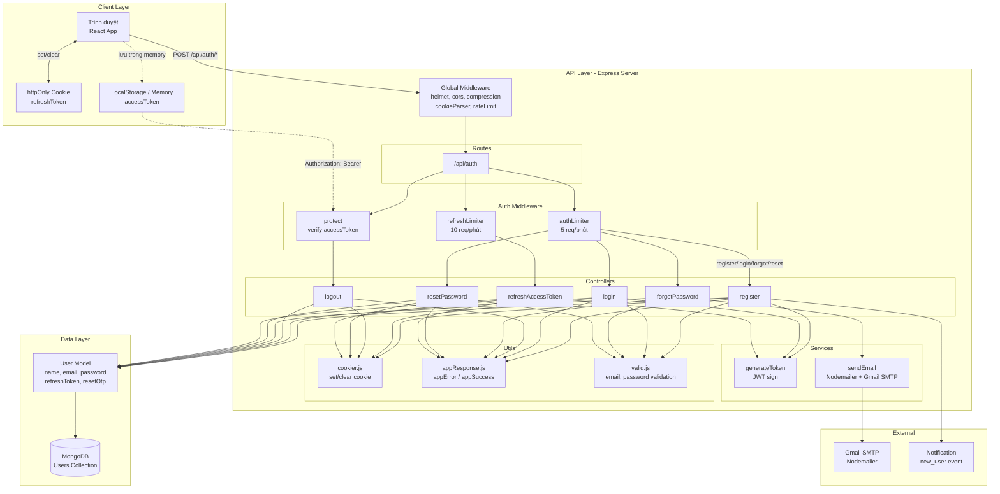
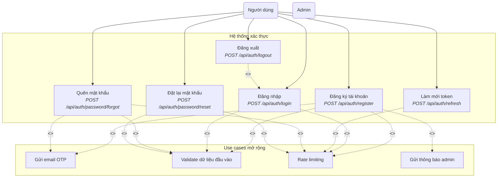
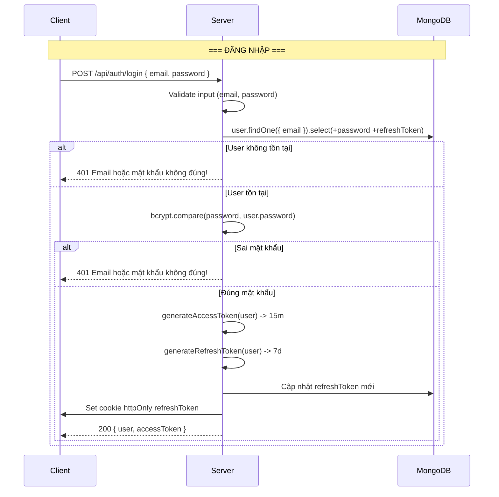
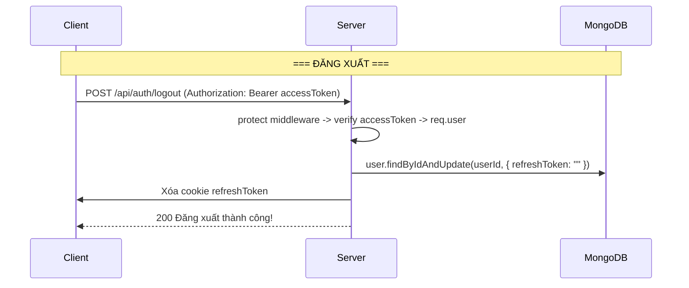
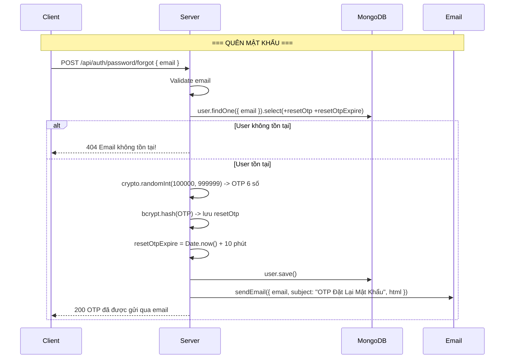
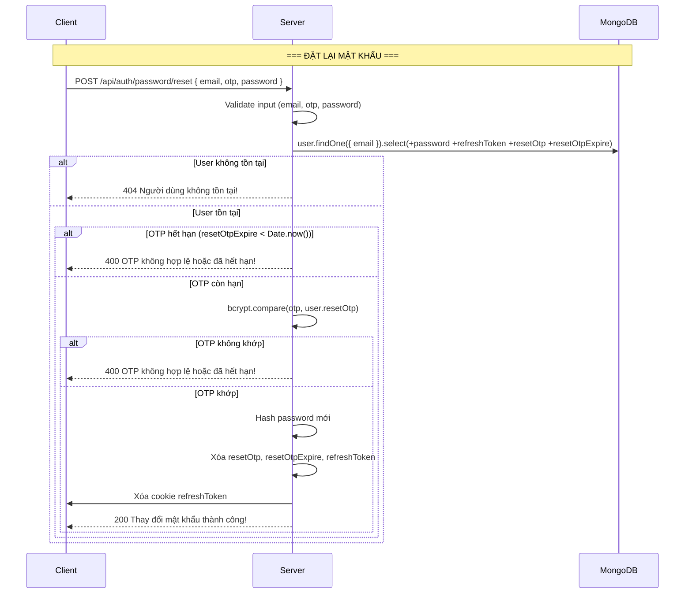
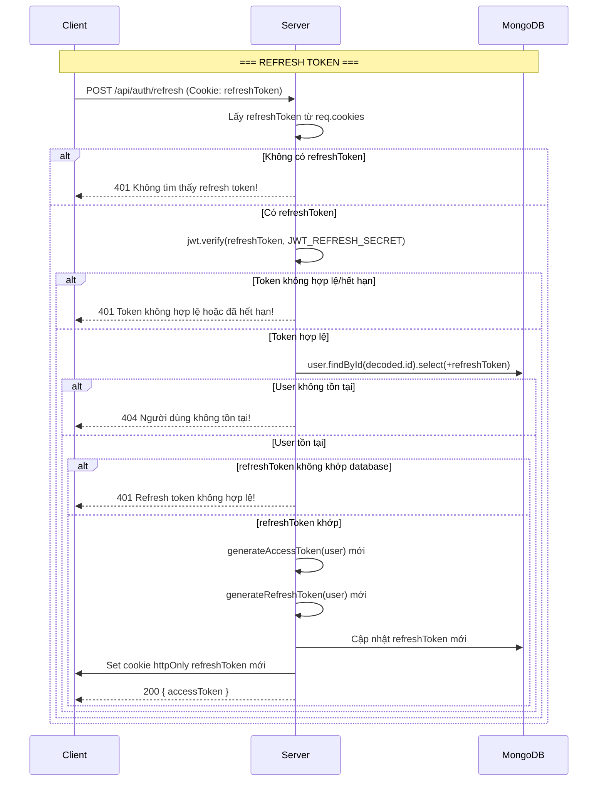

# Auth Flow

## Kiến trúc tổng quan



## Use Case Diagram



### Luồng request lifecycle

```
Client → Global Middleware → Router → Rate Limiter → Controller → Service/Model → MongoDB → Response → Client
                                     ↑
                               Auth Middleware (protect)
```

## Sequence Diagrams











## Danh sách API

| Method | Endpoint | Auth | Rate Limit | Mô tả |
|--------|----------|------|------------|-------|
| POST | `/api/auth/register` | Public | 5 req/phút | Đăng ký tài khoản |
| POST | `/api/auth/login` | Public | 5 req/phút | Đăng nhập |
| POST | `/api/auth/logout` | Protected | - | Đăng xuất |
| POST | `/api/auth/refresh` | Public | 10 req/phút | Làm mới access token |
| POST | `/api/auth/password/forgot` | Public | 5 req/phút | Gửi OTP quên mật khẩu |
| POST | `/api/auth/password/reset` | Public | 5 req/phút | Đặt lại mật khẩu |

## Cấu trúc file

```
src/
├── controller/auth.controller.js    # Xử lý logic auth
├── routers/auth.routes.js           # Định nghĩa routes
├── middleware/auth.middleware.js     # protect, adminOnly, authLimiter, refreshLimiter
├── services/generateToken.js        # Tạo JWT access & refresh token
├── services/sendEmail.js            # Gửi email OTP
├── utils/cookier.js                 # Quản lý cookie refresh token
├── utils/appResponse.js             # Format response chuẩn
├── utils/valid.js                   # Validate email, password
├── models/users.model.js            # User schema
└── config/middleware.config.js       # Global middleware
```

## Chi tiết kỹ thuật

### JWT Tokens

| Token | Thời hạn | Secret | Mục đích |
|-------|----------|--------|----------|
| Access Token | 15 phút | `JWT_ACCESS_SECRET` | Xác thực request (Authorization header) |
| Refresh Token | 7 ngày | `JWT_REFRESH_SECRET` | Làm mới access token (httpOnly cookie) |

### Cookie Config

- `httpOnly: true` - Chống XSS (JS không đọc được)
- `secure: true` (production) - Chỉ gửi qua HTTPS
- `sameSite: "strict"` (production) - Chống CSRF
- `maxAge: 7 ngày` - Khớp với thời hạn refresh token

### Validation Rules

- **Email**: Định dạng `xxx@yyy.zzz`
- **Password**: ≥8 ký tự, ít nhất 1 chữ hoa, 1 chữ thường, 1 số
- **OTP**: 6 số, hiệu lực 10 phút

### Rate Limiting

- **authLimiter**: 5 requests/phút cho register, login, forgot, reset
- **refreshLimiter**: 10 requests/phút cho refresh token
- **Global limiter**: 100 requests/15 phút (bỏ qua nếu là admin)
